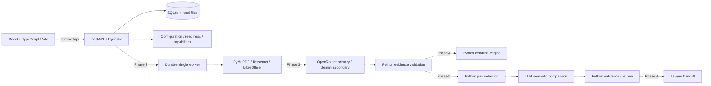

# AITHENA implementation phases

Each phase has a separate acceptance boundary. Phases 1–6 are integrated, with ingestion, extraction, deadlines, distribution conflicts and handoff enabled. Phase 7 bounded evaluation tooling and read-only replay are implemented; the live campaign stopped after its first request lacked trustworthy usage cost, so semantic accuracy and independent review remain outstanding. See `docs/PHASE_7_EVALUATION.md`. See `docs/PHASE_4_6_INTEGRATION.md` for combined verification and limitations.

| Phase | Deliverable | Acceptance boundary |
|---|---|---|
| 1. Runnable foundation | Builder 2's UI shell, local FastAPI, persistent SQLite, truthful health, generated contracts, launcher, tests | No key needed; no processing; disabled routes cannot mutate; schema/build/tests and local proxy work |
| 2. Ingestion and sources — implemented | Batch files/folders, originals/hashes, durable reading jobs, PDF/OCR/DOCX, every page with coordinates | Real clean/degraded scans and DOCX; duplicate/interrupted/error handling; local reading works without API key |
| 3. Grounded extraction — integrated | LLM typed extraction/support review, eight required fields, citation validation, provenance/confidence, SME selection | Every assertion supported; unknowns explicit; quota/key failures visible; no silent truncation |
| 4. Deadline calendar — integrated | Python offsets/windows/recurrence and 90-day event-or-action selection | Exact deadline fixtures pass; unknown triggers, business days and month-end ambiguity escalate |
| 5. Distribution conflicts — integrated | Python candidates plus LLM scope/exception comparison, validated assessments | Exclusive/non-exclusive overlaps, exclusions, non-overlapping dates and missing schedules evaluated; no breach claims |
| 6. Review and lawyer briefs — integrated | Review queue, cited issue summaries, missing facts and specific questions, printable/downloadable handoff | Lawyer can locate clauses and act on the issue; no automatic sending |
| 7. Evaluation and demo — bounded tooling implemented | Ten selected mixed-format sources, frozen provisional key/grouped holdout, guarded OpenRouter runner, transparent reports and read-only replay instructions | Local checks passed. First live request stopped on unaccounted cost; successful live evaluation, independent review and accuracy/calibration remain outstanding. Sample-mode UI deferred by user choice. |

Use the existing React/Vite frontend and its lockfile. This pulled repository supersedes the older Sites/Vinext frontend described in the initial handoff; there is no need to replace the frontend framework or deploy it. The Python API and generated records remain the compatibility boundary for all later phases.
