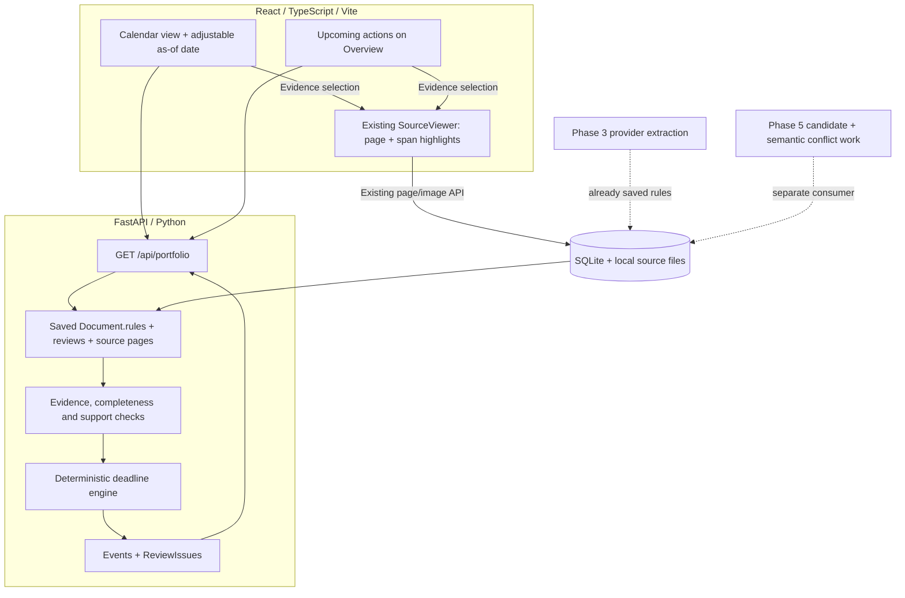

# Phase 4 handoff — grounded deadline calendar

**Owner:** Builder 2. **Parallel work:** Builder 1 / the user owns Phase 5 distribution conflicts.
**Starting point:** the merge into `main` containing Phase 2 checkpoint `f467ea8` and Phase 3 extraction commit `460049c`, plus the integration fixes described in `PHASE_3_INTEGRATION.md` in this directory. Start from the final merge on `main`, not the original extraction worktree.

Implement **Phase 4 only**, including its React interface. Stop after tested delivery and a completion note. Do not implement conflict assessment, lawyer-brief export, sample loading, legal chat, or deployment. Existing deadline/conflict modules are drafts, not acceptance evidence.

> Provider update after the Phase 3 merge: OpenRouter is primary and Gemini secondary. Read `docs/MODEL_PROVIDERS.md` for configuration and additive health/document metadata. Calendar code remains provider-independent and makes no model calls.

## 1. Start on your instance

Read `AGENTS.md`, `README.md`, `docs/INTEGRATION.md`, and this handoff. Inspect `git status` before changing files. Obtain the updated main commit through the team's Git transport; this handoff does not imply that the local merge was pushed. If your clone does not contain both commits above in main's ancestry, stop and obtain the merged baseline rather than using the old Phase 1 branch.

Create `codex/phase-4-deadlines` from updated `main`. Preserve `.env`, the SQLite data directory, originals, and other builders' work. Do not copy `.claude/worktrees`, virtual environments, or node_modules between machines.

Use Python 3.12+, the root `requirements.txt`, Node 22.13+ and the pinned pnpm version in `frontend/package.json`. Follow README setup and run the baseline checks below. No Gemini key is needed to develop or test the calendar: seed grounded `Document`, `DeadlineRule`, `Verdict`, and `Page` fixtures in an isolated test database. Never substitute synthetic results into the live workspace.

```sh
.venv/bin/python -m pytest -q
.venv/bin/python scripts/export_openapi.py --check
pnpm --dir frontend api:check
pnpm --dir frontend test
pnpm --dir frontend build
.venv/bin/python scripts/dev.py
```

If native OCR/DOCX tools are absent, record skipped native checks separately; do not claim those checks passed. Optional alternate ports are configured with `AITHENA_WEB_PORT` and `AITHENA_API_PORT`.

## 2. What is already integrated

- React 19 / TypeScript / Vite / Tailwind, with the existing blue/ink design. The browser uses relative `/api` requests and runtime validation against generated OpenAPI. Preserve this stack.
- FastAPI and Pydantic own schemas. SQLite stores documents, queue jobs, batches, settings, model-response caches and comparisons. Local files retain originals, canonical PDFs and page/span checkpoints.
- Uploads read PDF, DOCX, PNG/JPEG and scanned pages locally. Reading does not require Gemini. `POST /api/extract?document_id=...` explicitly queues model extraction after reading; the UI explains that page text goes to OpenRouter or Gemini.
- A **single locked worker** claims `ingestion` and `extract` jobs only. Old `document` and `conflict` jobs remain idle. Missing-key jobs block visibly; provider delays wait and resume without bypassing quota. Repeated extraction requests reuse active/completed work.
- Extraction produces eight finding categories, rules, commercial provisions and support verdicts. Python verifies source quotes, IDs, pages and coordinates. Missing fields remain unresolved. OCR, missing pages/context, rejected support and absent schedules reduce confidence or require review.
- Source viewing supports `Evidence` links to the exact physical page and **all cited span boxes**. Clause labels come from source parsing; no clause number is invented when none was detected. DOCX pages are labelled rendered pagination.
- SME selection is nullable and restricted to established parties in the current workspace. Do not call an obligation “yours” before selection; preserve the obligation's named party regardless of selection.
- Only `ingestion` and `extraction` capabilities are enabled. `/api/portfolio?mode=live&as_of=YYYY-MM-DD` already returns an adjustable Singapore as-of date and horizon end, but **events are currently empty**. A calendar placeholder is not portfolio clearance.

Model access, free-tier capacity, extraction accuracy and confidence calibration have not been validated by a live judging corpus. Unit tests use a fake model. Phase 4 must not describe those as verified.

## 3. Stack and Phase 4 flow



**No LLM call is made to calculate dates or refresh the calendar.** Python acts on already extracted rules after checking their grounding and completeness. Calendar evaluation can be a read-only projection on each portfolio request for this 80-document local MVP; it needs no separate worker, queue service, vector database or schema migration.

## 4. Canonical interfaces and compatibility

Inspect `backend/models.py` before coding; do not create parallel frontend models.

| Record | Existing fields used by Phase 4 |
|---|---|
| `Document` | `id`, `mode`, `status`, `page_count`, `pages_read`, `pages_analyzed`, `rules`, `reviews`, `issues`, `warnings`, `findings` |
| `DeadlineRule` | `id`, `citations`, `label`, `event_type`, `event_date`, `trigger`, `action`, `offset`, `earliest_offset`, `unit`, `direction`, `recurrence_months`, `month_end_rule`, `conditions`, `missing_inputs` |
| `Verdict` | `item_id`, `status` (`supported`, `uncertain`, `rejected`), `reason`, `missing_context` |
| `Evidence` | `document_id`, `span_ids`, `quote`, `page`, nullable `clause`, `boxes`, `source`, nullable `ocr_confidence` |
| `Event` | `id`, `document_id`, `label`, `event_type`, `event_date`, nullable `action_date`, nullable `window_start`, `action`, `formula`, `assumptions`, `confidence`, `evidence`, `provenance` |
| `ReviewIssue` | `id`, `document_ids`, `title`, `established`, `missing_facts`, `lawyer_question`, `urgency`, `evidence`, `kind`, `mode` |
| `Portfolio` | `mode`, `as_of`, `horizon_end`, `sme`, `parties`, `documents`, `events`, `issues`, `conflicts`, `comparisons`, `coverage` |

`event_date` is an ISO date string or null on the rule; unsupported/unknown inputs remain unknown. `action` distinguishes `notice_received`, `notice_sent`, `payment_due`, `review`, and `expiry`. Units are calendar days, calendar months, business days, or unknown. The current month-end enum is only `last_day | unspecified`: it does not represent every possible counting convention.

Keep the existing public deadline entry point:

```python
def calendar_for(doc: Document, pages: list[Page], as_of: date, days: int = 90) -> tuple[list[Event], list[ReviewIssue]]:
    ...
```

Extend this draft rather than replacing it with frontend date arithmetic. `calculate`, `shift`, and `offset_months` are draft helpers and may be refactored within this module. Do not make Phase 5 import them as a new shared dependency without coordinating an explicit interface.

Current `Event.provenance` only permits `calculated`. Keep calculated events within that schema unless an additive extension is necessary. If displaying a purely explicit source date, do not claim arithmetic occurred: use a truthful formula/label and coordinate a backwards-compatible provenance extension if required. `Event` also has no confidence-reason or input-level provenance record today. If needed, add optional/defaulted fields, preserving old persisted documents and regenerating schemas/types. Do not invent high confidence from the fact that Python returned a date.

Phase 3 citations are attached to the rule as a whole. That alone does **not** prove every arithmetic input has support. Require unambiguous grounding for anchor, offset, unit, direction and any renewal/month-end convention. If the existing rule cannot express a needed input, raise a review issue; do not guess. An optional input-evidence map is an extension to agree before changing the extraction schema/prompt that Builder 1 also consumes.

## 5. Implementation sequence

### A. Test and repair the deterministic engine

First write a synthetic table of inputs, evidence, expected dates and expected stop reasons independently of the implementation. Cover the examples below, then repair the draft.

- Calendar-day arithmetic uses `datetime.date` and `timedelta`.
- Calendar-month arithmetic keeps the original anchor. Clamp only if the contract establishes the applicable rule. The present helper's `last_day` behavior is clamping an invalid day, not an established universal end-of-month convention. If a different convention is required, escalate or explicitly model it.
- Calculate both notice-window boundaries and reject reversed windows.
- Preserve received-versus-sent language. A receipt deadline is not a dispatch deadline. An explicit received-by date can be displayed while stating that safe dispatch timing is unestablished. Unknown required delivery mechanics must not generate a dispatch recommendation.
- Enumerate **all relevant occurrences**, including multiple monthly/quarterly occurrences within the horizon. The existing draft emits only one occurrence per rule, which misses deadlines. Use bounded iteration and stop with a visible issue on an unsupported range rather than truncating silently.
- Derive each recurrence from the original anchor; do not compound a February clamp into March drift. Future renewal occurrences remain conditional on continuing operation, no effective notice and no relevant amendment.
- Include an event if **its event date OR action deadline** is in `[as_of, as_of + 90 days]`, inclusive. Include a notice window that intersects that horizon even if neither closing/event date lies inside it.
- Include overdue actions tied to upcoming events in that horizon. Label them overdue, with the event still shown. Do not show every historical missed deadline indefinitely. Document the bounded rule used for overdue-only payment/other items when performance is unknown; do not assert non-payment.
- Do not advance past a recurring trigger before considering a later action: a past trigger with an action due after it may still matter today.
- Sort reproducibly by earliest relevant action/window date, then event date and stable ID. Stable IDs must include document, rule and occurrence; do not change them when the as-of filter changes.

### B. Apply competence gates before emitting an event

Revalidate citations against the saved pages. Require the matching support verdict to be supported, with no unresolved required context. Treat malformed/missing checkpoints, unreadable pages, missing schedules and incomplete extraction as incomplete coverage, not an empty successful calendar.

Only use the current completed analysis of a document. A queued, extracting, waiting, failed or partially reviewed run must not silently supply definitive dates from retained older findings. Existing empty rules on unprocessed documents do not mean “no deadlines”.

Missing required inputs, contradictory anchors, unknown effective dates, unknown invoice/breach receipt, undefined business days, ambiguous month-end rules and ambiguous conditions produce `ReviewIssue(kind='deadline')`. Cite available evidence but do not populate `established` from a model's unsupported label/trigger text. Questions should identify the missing fact or convention, not merely say “consult a lawyer”.

Confidence inherits the weakest relevant source/input; OCR and inferred/conditional inputs cannot become high-confidence just because arithmetic is exact. Keep calculated provenance distinct from confidence. Python cannot establish enforceability, actual breach, delivery success, continued operation or that a payment remains unpaid.

### C. Connect the API without breaking Phase 5

In `/api/portfolio`, call the deterministic engine for eligible documents using the request's validated `as_of`. Default remains `datetime.now(ZoneInfo('Asia/Singapore')).date()`. Keep live/sample separation.

Populate `events` and append deadline issues to the existing extracted/source issues. Deduplicate issues by stable ID. Preserve `conflicts`, `comparisons`, SME and coverage fields for Phase 5. Do not overwrite document issues with date-dependent projections or create recurring queue jobs on each GET.

If one document's source cache cannot be read, return a document-specific deadline review issue and incomplete coverage indication while processing other documents. Do not hide the failure or turn it into portfolio-wide “all clear”. Preserve genuine database failure behavior.

Enable only `CAPABILITIES.deadlines` when the engine, API and UI pass acceptance. Do not set `conflicts`, `handoff` or `sample_workspace`. Keep import/schema export free of storage/model side effects.

### D. Build the frontend

Add `frontend/src/Calendar.tsx` and focused styles. Reuse canonical generated `Event`/`ReviewIssue` types and the current evidence viewer. Keep visual design and mobile layout.

- Calendar: adjustable as-of date, visible Singapore horizon, list grouped by actionable date; event date, action deadline, window, overdue/conditional status, formula, assumptions, confidence explanation and source buttons.
- Overview: next actions and count of documents with unestablished dates/analysis. Do not combine payments and liability caps into an exposure total.
- Date-related unresolved items must be visible in Phase 4 even before the dedicated Phase 6 review queue exists. Show evidence and specific missing facts/questions inline or in a calendar review section. Brief download/print is Phase 6.
- Empty copy distinguishes no events found in the supported/processed subset from incomplete or unprocessed documents. Never say “nothing to worry about”.
- Stale/API-error states disable reliance and retain visible stale labels. Use request cancellation or sequence protection so rapid as-of changes cannot show an old response under a new date.
- Source selection uses a shared callback `onEvidence(e: Evidence)`. The shell selects `e.document_id`, opens the existing SourceViewer and supplies the evidence; all cited boxes on `e.page` highlight. Preserve ordinary library navigation and the extraction source viewer.

### E. Validate and stop

Regenerate OpenAPI and TypeScript after Python schema/route changes:

```sh
.venv/bin/python scripts/export_openapi.py
.venv/bin/python scripts/export_fixtures.py
pnpm --dir frontend api:generate
.venv/bin/python -m pytest -q
.venv/bin/python scripts/export_openapi.py --check
pnpm --dir frontend api:check
pnpm --dir frontend test
pnpm --dir frontend build
```

Run a real browser walkthrough of selecting an as-of date, opening a notice event, following evidence to its highlighted page, and seeing an unanswerable invoice-receipt rule in the review section. Use isolated synthetic data. Record actual results in `docs/PHASE_4_COMPLETION.md`, update status docs, and stop. Report limitations/skips; unit coverage is not measured extraction accuracy.

## 6. Minimum acceptance fixtures

| Case | Expected behavior |
|---|---|
| Expiry 2026-12-31; notice received 60 calendar days before | 2026-11-01, labelled **received**, with expiry and notice evidence and subtraction shown |
| Notice window 90–60 days before same expiry | 2026-10-02 through 2026-11-01; preserve both boundaries |
| As-of 2026-09-05 (horizon ends 2026-12-04) | Include the November action even though December 31 expiry is beyond the horizon |
| As-of 2026-12-01 for same expiry/notice | Show overdue November notice and upcoming December expiry; do not assert valid renewal cancellation is still possible |
| Event/action exactly at horizon start/end, then one day outside | Inclusive boundaries; outside dates excluded unless the other date or a window is relevant |
| Monthly recurring rule with several occurrences inside horizon | Every relevant occurrence appears once, conditional and with stable IDs |
| Past trigger plus after-offset action inside horizon | Action remains visible; recurrence advancement does not skip it |
| January 31 plus one month with unspecified rule | No definitive adjusted date; review issue |
| Supported contractual clamp with January 31, February and March occurrences | Correct February leap/non-leap result; March returns to anchor day, no drift |
| Explicit unambiguous month offset with valid target day | Exact arithmetic, no invented month-end convention |
| Business days with no defined convention | Review issue; no calendar-day fallback or guessed public holiday calendar |
| Payment 30 days after invoice receipt, receipt unknown | No payment deadline; specific missing-receipt question with clause citation |
| Missing Schedule 1 / conflicting effective dates / unsupported verdict | No definitive calculated event; grounded review issue |
| Low-quality OCR inputs / conditional continuation | Low or medium inherited confidence with explanation, never promoted to high |
| Fabricated span/quote, missing page cache, incomplete read/support review | Visible failure/uncertainty; other valid contracts still produce results |
| Repeated portfolio reads and different as-of dates | No model calls, no new jobs, no duplicate persisted issues, deterministic output |
| Concurrent Phase 5 comparison records present | Calendar refresh preserves those records and counts |

## 7. Parallel ownership with Phase 5

Both phases depend on the merged Phase 3 baseline. Phase 5 need not wait for the calendar implementation: compare supported commercial provision dates in `backend/conflicts.py` independently. Calendar occurrence dates must not be treated as proof that an agreement is still operating.

| Ownership | Files / responsibilities |
|---|---|
| Builder 2 — Phase 4 | `backend/deadlines.py`, new deadline tests, `frontend/src/Calendar.tsx`, its tests and dedicated CSS, `docs/PHASE_4_COMPLETION.md` |
| Builder 1 — Phase 5 | `backend/conflicts.py`, new conflict tests, conflict UI component/CSS, comparison queue/validation logic; `backend/worker.py`, provider comparison changes and store comparison methods |
| Shared: keep edits small and additive | `backend/api.py`, `backend/models.py`, `backend/foundation.py`, `frontend/src/App.tsx`, `frontend/src/api.ts`, shared evidence navigation, status documentation |
| Generated, never hand-merge | `shared/openapi.json`, `shared/api.generated.ts`, backend-derived fixtures; regenerate after combined changes |

Coordinate any new shared field/interface before implementing it. Phase 4 should not change extraction jobs, provider prompts or worker ownership. Phase 5 must retain ingestion/extraction dispatch and the single-worker lock; add conflict handling only behind its capability, not an `else` that consumes every job type.

At final integration, merge source changes first. Preserve both the calendar projection and conflict counts in portfolio, both capability flags independently, and both UI views. Regenerate schema/type artifacts from the merged Python source and run both phase suites. Do not resolve shared files by taking one branch wholesale.

## Builder 2 task prompt

> Implement Phase 4 only from the latest merged main, following docs/PHASE_4_HANDOFF.md and AGENTS.md. Build and test the deterministic grounded deadline engine, connect the existing portfolio API, and deliver the React calendar and upcoming-actions UI with exact source links and visible unresolved cases. Preserve the completed ingestion/extraction flows. I am implementing Phase 5 concurrently; respect the ownership table, keep shared interfaces additive, and do not modify my conflict worker/provider work. Do not call Gemini for date calculations. Record checks and limitations in docs/PHASE_4_COMPLETION.md and stop at the Phase 4 checkpoint.
